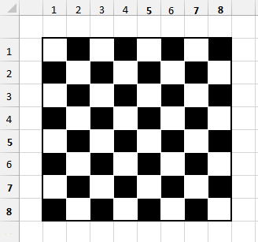
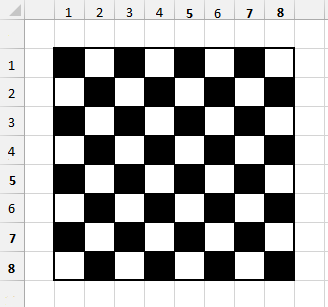

# README

* Ruby version: 2.3.1p112

* Rails version: 5.1.3

* Dependencies: 
	- nodejs - v4.2.6
	- sqlite3 - 3.11.0

* Command to start >> bin/rails server

* Default rails url after start: http://localhost:3000

# CheckersApi

Not very familiar with ruby (more so with ruby on rails), forgive for any out of standard code
	- for example, column names in db are camelToe, and not underline spaced

A checker game look:

Which is the same as:

> The pieces go on the white squares
>
> The boards are the same with a 90º turn

## For this game:
* The board should be seen by the user as an 8x8 matrix starting at index 1 - Matrix(1..8)(1..8)
	- So from (1)(1) up to (8)(8)
* The second look will be treated as the first look; that means that the position (1)(2) will be treated as position (1)(1). 
	- therefore the possible move for that would be (2)(2) (if empty)
* Player one starts at the "top" - (1)(1); (1)(3); (1)(5); (1)(7); (2)(2); (2)(4); (2)(6); (2)(8); (3)(1); (3)(3); (3)(5); (3)(7)
* Player two starts at the "bottom" - (8)(2); (8)(4); (8)(6); (8)(8); (7)(1); (7)(3); (7)(5); (7)(7); (6)(2); (6)(4); (6)(6); (6)(8)
* Player one pieces are named "1", player 2 pieces "2", and empty spaces "0"
* King pieces are named -1 and -2 respectively to player 1 and player 2
* As in a checkers game only half the spaces can ever be occupied, the board is treated in the model (only in the model) as an 8x4 matrix represented as a comma separated string
* Index is a summary of the db contents, should not be considered as an actual page (it would be removed if deploying)

## Requisições:
> To help with requests there is a form page for each game

* Create game: 
	- Post /games
	- No parameters (Post data) required
* Join game: 
	- Post /games/:game_id/join
	- Parameter: 
		- player_2_join[access_token]
* Game status
	- Post /games/:game_id/status
	- Parameters: 
		- status_token_validation[player]
		- status_token_validation[player_token]
* Check allowed moves for a piece
	- Post /games/:game_id/check_moves
	- Parameters:
		- check_moves[player]
		- check_moves[player_token]
		- check_moves[row]
		- check_moves[col]
* Make move|play
	- Post /games/:game_id/check_moves
	- Parameters:
		- move[player]
		- move[player_token]
		- move[from_row]
		- move[from_col]
		- move[to_row]
		- move[to_col]

> All row and columns range from 1..8

### Features not implemented or not fully tested
* King piece (not fully implemented, not fully tested) 
	- When the piece reaches final opposite row, the game might get stuck at some point
	- King piece only moves one square like other pieces, but in all directions
* Multiple jumps - max of one jump per play